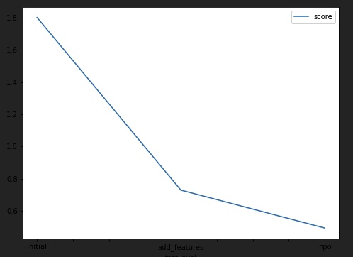

# Report: Predict Bike Sharing Demand with AutoGluon Solution
#### Nadim Kawwa

## Initial Training
### What did you realize when you tried to submit your predictions? What changes were needed to the output of the predictor to submit your results?
It was imperative to have all values larger than 0.

### What was the top ranked model that performed?
Top ranked model was a weighted Ensemble model "WeightedEnsemble_L2" that also benefited from feature engineering.

## Exploratory data analysis and feature creation
### What did the exploratory analysis find and how did you add additional features?
I looked into dividing the data based on quartiles, this will create a ranking that will aid the classifiers. I also looked into a Pearson correlation matrix for the models.

### How much better did your model preform after adding additional features and why do you think that is?
the R2 score was cut almost in half from approximately 1.8 to 0.74. It could be that our original features were just not enough, specifically the date column as a datetime object can have little to no impact. We also fixed the dtypes of some features to force the learners to treat them as the intended type.

## Hyper parameter tuning
### How much better did your model preform after trying different hyper parameters?
The change was noticeable altough not as dramatic. The performance did improve as we allowed our automatic training to optimize hyperparameters. I used the documentation presets as a way to figure out a good starting poijnt for hyperparameter tuning.

### If you were given more time with this dataset, where do you think you would spend more time?
First thing would be to allocate more training time altough that would mean more resources. I would look into adding additional features such as if it's a morning rush hour (7 to 9AM) or an evening rush hour (5 to 7PM). Moreover, AutoGluon allows for additional models such as Random Forest and XGBoost that we can take advantage of.

### Create a table with the models you ran, the hyperparameters modified, and the kaggle score.
|model|hp01|Presets|hp02|score|
|--|--|--|--|--|
|Base Model|None|best_quality|None|1.8|
|Added Features|None|best_quality|None|0.73|
|hpo|NN (Learning rate, epochs, activation, dropout prob)|best_quality|GBM (Num boost rounds, num leaves) |0.58|

### Create a line plot showing the top model score for the three (or more) training runs during the project.

### Create a line plot showing the top kaggle score for the three (or more) prediction submissions during the project.

## Summary
Using advanced feature engineering and hyperparamter tuning we were able to obtain a rather solid R2 score of around 0.4
